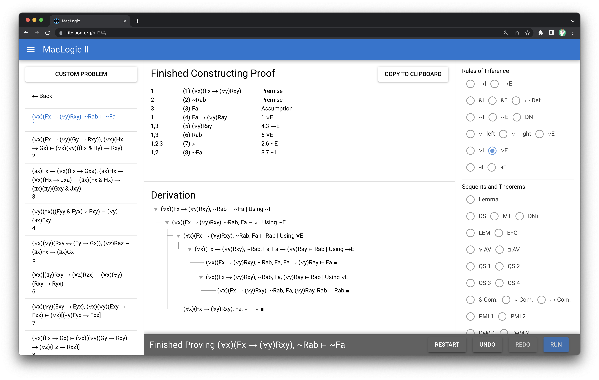

# MacLogic (maclogic)

An Educational Proof Assistant for learning Natural Deduction.



## Install the dependencies
```bash
npm install
```

### Add [Coastline](https://github.com/imapersonman/coastline) as a local dependency

```bash
cd ../path/to/place/coastline
git clone https://github.com/imapersonman/coastline.git
npm install --save ../path/to/place/coastline
```

### Start the app in development mode (hot-code reloading, error reporting, etc.)
```bash
quasar dev
```

### Build the app for production
```bash
quasar build
```

### Customize the configuration
See [Configuring quasar.conf.js](https://v2.quasar.dev/quasar-cli/quasar-conf-js).